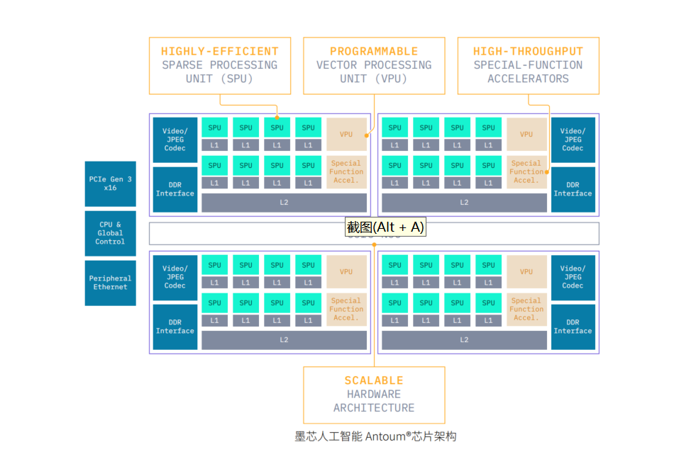
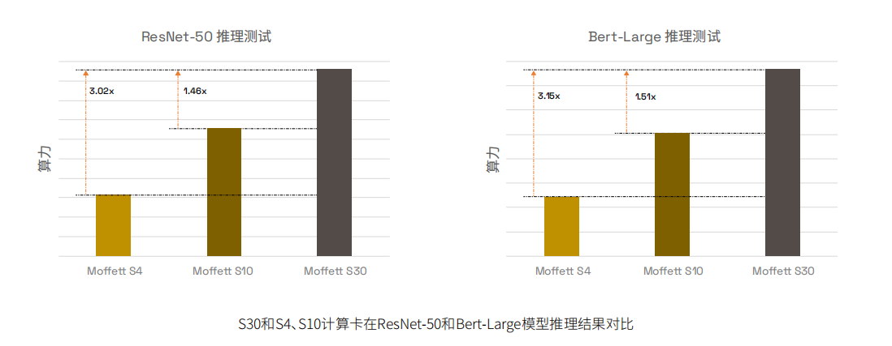
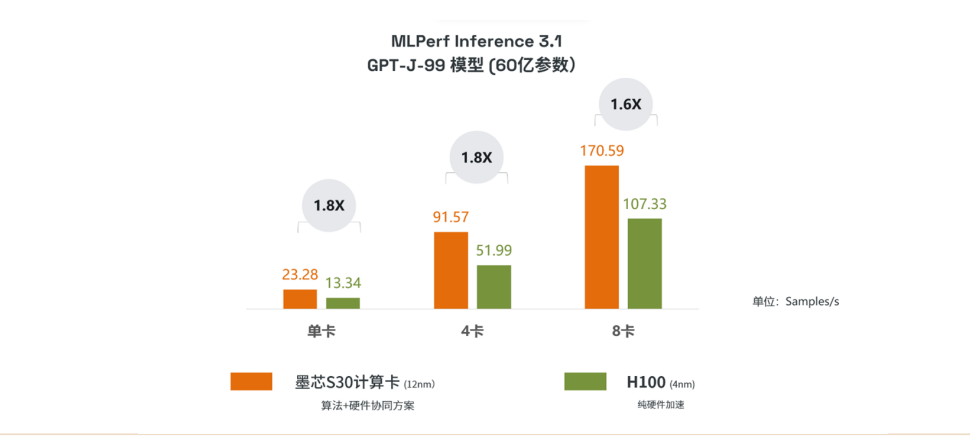
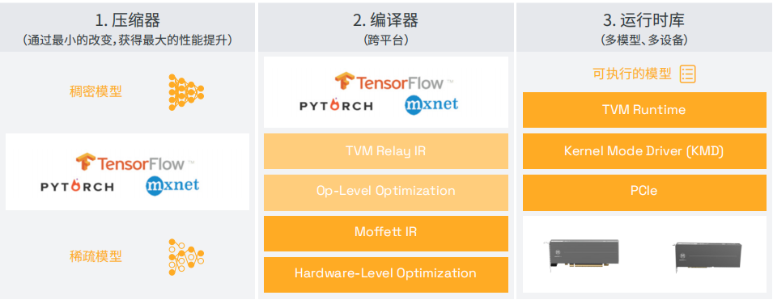

# 墨芯 S30 AI 计算卡 Datasheet

## 产品简介

墨芯人工智能S30计算卡(以下简称S30)搭载墨芯首颗芯片Antoum®,是高达32倍稀疏率的AI计算卡。S30专注于数据中心AI推理应用，可广泛应用于互联网、运营商、智慧城市、生命科学、自动驾驶等众多AI推理场景。

S30在250 W功率下提供等效于 2832 TOPS INT8 和 1415.4TFLOPS BF16 的算力 (32倍稀疏化)。板载60 GBLPDDR4x内存，S30可以提供高达168 GB/s内存峰值写带宽和198 GB/s内存峰值读带宽。墨芯人工智能独创双稀疏算法技术和Antoum®芯片架构,与市场上同类产品相比，S30算力具有数量级提升，并为客户极大降低TCO(TotalCost of Ownership,即总拥有成本)。

通过软硬件紧密结合的AI SoC设计，原生稀疏卷积和矩阵乘法的稀疏处理单元(SPU)与异构的特殊功能加速 

器，让AI推理应用效率最大化，为客户提供最大价值。矢量处理单元(VPU)可以提供灵活的可编程性，支持 

快速发展的AI算法框架。例如，在视频和图像处理上，视频编解码器以高达30 FPS的速度解码192路1080p 

的视频，JPEG解码器以高达6960 FPS的速度解码1080p的图像。

## 系统参数

| BF16稀疏处理单元峰值    | 44.1 TFLOPS \| 1415.4 TFLOPS*                                |
| ----------------------- | ------------------------------------------------------------ |
| INT8稀疏处理单元峰值    | 88.5 TOPS \| 2832 TOPS*                                      |
| BF16矢量处理单元峰值    | 9.6 TFLOPS                                                   |
| 多媒体引擎              | 12个视频解码器硬件，30 FPS的速率解码192路1080p的视频 3个视频编码器硬件，30 FPS的速率编码24路1080p的视频 24个JPEG解码器，6960 FPS的速率解码支持1080p的图像 |
| 硬件加速                | 激活函数加速器  TOPK硬件加速器 数据排布引擎 嵌入查找加速器 图像处理器（裁剪、调整大小和色彩空间转换） |
| 内存                    | 60 GB LPDDR4x                                                |
| 理论内存峰值带宽        | 内存峰值写带宽 168 GB/s 内存峰值读带宽 198 GB/s              |
| 系统接口                | PCIe Gen4 x16                                                |
| 外形规格                | 全高全长，双槽                                               |
| 散热解决方案            | 被动式                                                       |
| 最大散热设计功耗（TDP） | 250 W                                                        |

**注:** *表示32倍稀疏

## 产品性能

实测数据显示，S30相较于S4和S10，可提供更高的算力。ResNet-50和Bert-Large模型在S4、S10和S30计算卡的测试结果如下所示：

MLPerf Inference 3.1中，S30在大模型GPT-J（60亿参数）上，与 4nm制程的英伟达H100纯硬件加速方案相比，12nm制程的S30通 过“原创的双稀疏算法硬件协同”方式，取得了高达1.8倍的优势。 S30在8卡、4卡、单卡模式下，性能分别为170.59，91.57，23.28  (Sample/s)，达到H100性能的1.6倍、1.8倍、1.8倍。 

## 突破性创新技术

### 墨芯Antoum®️架构 

Antoum®架构通过软硬件协同设计的创新方法实现高性能和高能效。 

- 稀疏处理单元可支持高达32倍稀疏化，并具备线性加速比。 
- 定制的激活引擎直接支持BERT模型中使用的GELU等复杂激活函数，以及可用于实现复杂激活函数的指数、对数、倒数等基本数学运算。 
- 稀疏处理单元本身支持卷积和矩阵乘法运算，可以动态支持算子融合计算，如偏置加法、元素运算、量化和一些简单激活函数。 
- 芯片计算单元和大容量大带宽片上存储紧密耦合，结合模型压缩稀疏能力，各种计算均可以在Antoum®芯片上完成，计算效率在业界处于领先位置。

### 高倍率稀疏张量核 

S30计算卡是业界支持高倍率稀疏张量运算的AI推理加速卡，支持高达32倍稀疏率，同时实现稀疏神经网络 

的高模型精度和高硬件执行效率。 

### 高性能多媒体处理能力 

S30计算卡集成专用硬件视频编解码器引擎和JPEG解码器引擎。S30支持创新智能视频分析服务，可轻松集成 

可扩展的深度学习算法，配备12个视频解码器引擎和3个视频编码引擎，可以编解码4K多路视频流数据。24个 

JPEG解码器可以减轻CPU密集型的JPEG解码任务，以每秒6000帧以上的速度解码1080p JPEG图像数据。 

### 可扩展性 

S 30计算卡通过自定义稀疏处理单元和其他 辅助加速单元形成 稀疏 处 理子系统，包括专用视频编解码 

器、JPEG解码器引擎、词向量查找单元、内存格式转换引擎、向量处理器。12个稀疏处理子系统每4个通过 

高带宽片上环网组成一个完整的芯片，可扩展的多通道子系统可以灵活地支持并行模型和并行数据计算。

## 企业级端到端的解决方案

墨芯SparseRT™️ 软件开发环境全面支持S30，为快速开发提供了完整的可扩展平台并激活稀疏计算的潜力。除了S30，SparseRT™️ 可以高效支持通用的AI編程框架，如TensorFlow、PyTorch、ONNX和MXNet 等。用户可以在熟悉的TensorFlow或PyTorch环境里进行开发之后再进行迁移与交付。 

SparseRT™独特的SparseOptimizer™为AI模型提供4至32倍的稀疏压缩能力，并且很容易集成到现有的模型交付流程中，从而充分释放大型模型的实时服务潜力。SparseRT™提供可视化性能分析工具，支持离线和实时的模型性能分析，帮助开发人员分析模型中存在的瓶颈，并为开发人员提供模型部署优化建议，使开发人员能将S30计算卡软硬件解决方案几乎零成本集成到现有的基础设施和算法交付中。 