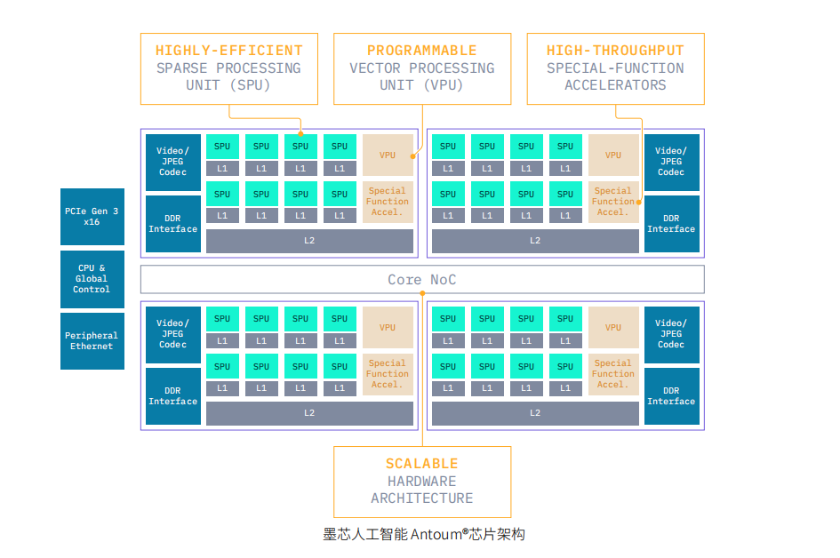
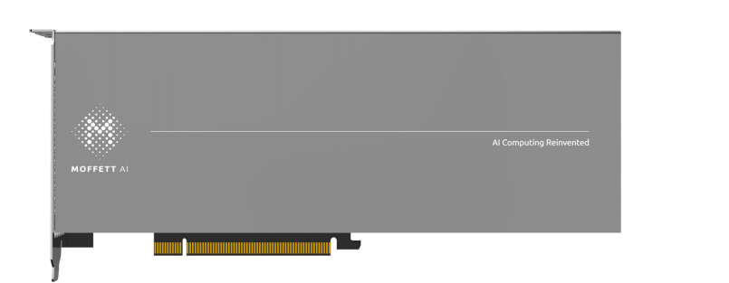

# 墨芯 S4 AI 计算卡 Datasheet

## 产品简介

墨芯人工智能S4计算卡(以下简称S4)搭载墨芯首颗芯片Antoum®是全球首款高达32倍稀疏率的AI计算卡。S4专注于数据中心AI推理应用,可广泛应用于互联网、运营商、智慧城市、生命科学、自动驾驶等众多AI推理场景。

S4在70 W功率下提供等效于943.6 TOPS INT8和471.8TFLOPS BF16的算力(32倍稀疏化)。板载20 GB LPDDR4x内存，S4可以提供高达56 GB/s内存峰值写带宽和66 GB/s内存峰值读带宽。

墨芯人工智能独创双稀疏算法技术和Antoum®芯片架构,与市场上同类产品相比，S4算力具有数量级提升,并为客户极大降低TCO(Total Cost of Ownership,即总拥有成本)。

通过软硬件紧密结合的AI SOC设计，原生稀疏卷积和矩阵乘法的稀疏处理单元(SPU)与异构的特殊功能加速器，让AI推理应用效率最大化,为客户提供最大价值。量处理单元(VPU)可以提供灵活的可编程性，支持快速发展的AI算法框架。例如，在视频和图像处理上，视频编解码器以高达30 FPS的速度解码64路1080p的视频，JPEG解码器以高达2320 FPS的速度解码1080p的图像。

## 系统参数

| BF16稀疏处理单元峰值    | 14.7 TFLOPS \| 471.8 TFLOPS*                                 |
| ----------------------- | ------------------------------------------------------------ |
| INT8稀疏处理单元峰值    | 29.5 TOPS \| 943.6 TOPS*                                     |
| BF16矢量处理单元峰值    | 3.2 TFLOPS                                                   |
| 多媒体引擎              | 4个视频解码器硬件，30 FPS的速率解码64路1080p的视频  1个视频编码器硬件，30 FPS的速率编码8路1080p的视频  8个JPEG解码器，2320 FPS的速率解码支持1080p的图像 |
| 硬件加速                | 激活函数加速器  TOPK硬件加速器 数据排布引擎 嵌入查找加速器 图像处理器（裁剪、调整大小和色彩空间转换） |
| 内存                    | 20 GB LPDDR4x                                                |
| 内存峰值带宽            | 内存峰值写带宽 56 GB/s 内存峰值读带宽 66 GB/s                |
| 系统接口                | PCIe Gen3 x16                                                |
| 外形规格                | 半高半长，单槽                                               |
| 散热解决方案            | 被动式                                                       |
| 最大散热设计功耗（TDP） | 70 W                                                         |

## 产品性能

实测数据显示，S4在不影响精度的前提下，可提供超高算力、极低功耗。ResNet50、BERT、RCAN和T5-8B的模型，在S4的测试结果如下所示：

**性能测试**

实测数据显示，S4计算卡的性能测试领先行业。因此S4计算卡在不影响精度的前提下可提供更高算力，而且功耗 

远低于国际头部厂商同类产品，为最终用户带来更好的性能和能效比。

## 突破性创新技术

### 墨芯Antoum®️架构

Antoum®架构通过软硬件协同设计的创新方法实现高性能和高能效。 

- 稀疏处理单元可支持高达32倍稀疏化，并具备线性加速比。 
- 定制的激活引擎直接支持BERT模型中使用的GELU等复杂激活函数，以及可用于实现复杂激活函数的指数、对数、倒数等基本数学运算。 
- 稀疏处理单元本身支持卷积和矩阵乘法运算，可以动态支持算子融合计算，如偏置加法、元素运算、量化和一些简单激活函数。 
- 芯片计算单元和大容量大带宽片上存储紧密耦合，结合模型压缩稀疏能力，各种计算均可以在Antoum® 芯片上完成，计算效率在业界处于领先位置。

### 高倍率稀疏张量核 

S4计算计算卡是业界第一款支持高倍率稀疏张量运算的AI推理加速卡，支持高达32倍的稀疏率，同时实现稀疏

神经网络的高模型精度和高硬件执行效率。

### 高性能多媒体处理能力 

S4计算卡集成专用硬件视频编解码器引擎和JPEG解码器引擎。S4支持创新智能视频分析服务,可轻松集成可扩展的深度学习算法，配备4个视频解码器引擎和1个视频编码引擎,可以编解码4K多路视频流数据。8个JPEG解码器可以减轻CPU密集型的JPEG解码任务,以每秒2000帧以上的速度解码1080P JPEG图像数据。

### 可扩展性

S4计算卡通过自定义稀疏处理单元和其他辅助加速单元形成稀疏处理子系统,包括专用视频编解码器、JPEG解码器引擎、词向量查找单元、内存格式转换引擎、向量处理器。4个稀疏处理子系统通过高带宽片上环网组成一个完整的芯片,可扩展的多通道子系统可以灵活地支持并行模型和并行数据计算。

## 企业级端到端的解决方案

墨芯SparseRT™️ 软件开发环境全面支持S4，为快速开发提供了完整的可扩展平台并激活稀疏计算的潜力。除了S4，SparseRT™️ 可以高效支持通用的AI編程框架，如TensorFlow、PyTorch、ONNX和MXNet 等。用户可以在熟悉的TensorFlow或PyTorch环境里进行开发之后再进行迁移与交付。 

SparseRT™独特的SparseOptimizer™为AI模型提供4至32倍的稀疏压缩能力，并且很容易集成到现有的模型交付流程中，从而充分释放大型模型的实时服务潜力。SparseRT™提供可视化性能分析工具，支持离线和实时的模型性能分析，帮助开发人员分析模型中存在的瓶颈，并为开发人员提供模型部署优化建议，使开发人员能将S4计算卡软硬件解决方案几乎零成本集成到现有的基础设施和算法交付中。 