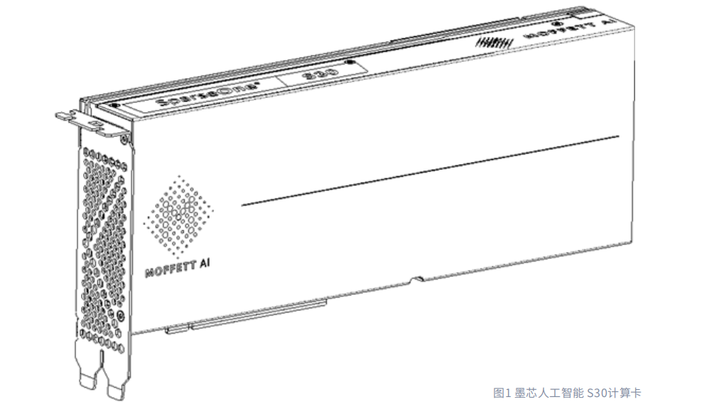
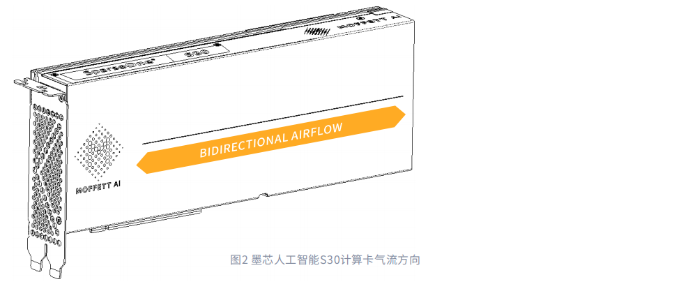
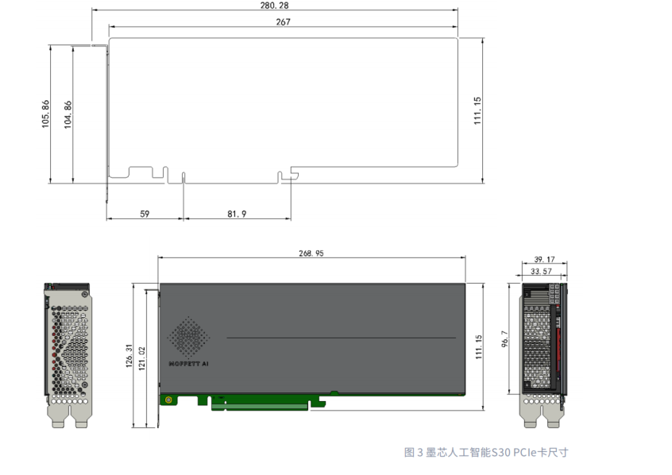

# 墨芯 S30 AI 计算卡产品手册

## 概述

墨芯人工智能S30计算卡(下文简称S30计算卡)为数据中心的AI推理应用而打造。作为通用深度学习推理加速器,外形规格采用双槽PCle Gen4 x16的全高全长的设计方式。S30计算卡支持60 GB LPDDR4x内存,高达168 GB/s内存峰值写带宽和198 GB/s内存峰值读带宽，最大功耗250 W。被动冷却板设计使其在热限制内，

通过系统气流来实现计算卡的操作。

S30计算卡基于墨芯人工智能Antoum®️架构构建。通过软硬件紧密结合的架构设计,强调平衡的结构化稀疏性,支持高达32倍的高稀疏率。基于Antoum®️架构,S30计算卡支持BF16和INT8计算。同时，S30计算卡支持包括集成模型稀疏器的软件工具链、编译器和运行时在内的端到端软件解决方案,确保主流AI推理作业可以快速实现。

硬件与软件紧密结合的设计使得Antoum®️成为一个高效的人工智能片上系统处理器。此外,S30计算卡还支持硬件视频编解码器和JPEG解码器,使其能够处理各种视频和图像应用场景。同时,S30计算卡随设备发货时，为系统DDR开启ECC功能,防止内存出现可检测的错误。

## 规格

### 产品规格

| **规格**            | **描述**                                                     |
| ------------------- | ------------------------------------------------------------ |
| 产品名称            | SparseOne®疏云®AI计算卡系列\|墨芯S30计算卡                   |
| 总板卡功率          | 250 W                                                        |
| Antoum®芯片名称     | 墨芯Antoum®英腾芯片                                          |
| 机械外形规格        | 双槽，全高全长                                               |
| PCI IDs             | Device ID: 0x7030 Vendor ID: 0x1F36  Sub-vendor ID: 0x1F36  Sub-system ID: 0x7000 |
| VBIOS NOR-Flash大小 | 16 MB                                                        |
| 热冷却解决方案      | 被动式                                                       |
| 系统接口            | PCIe Gen 4 x16                                               |
| 板卡重量            | 1584.4 g                                                     |

### 内存规格

| **规格**         | **描述**                                          |
| ---------------- | ------------------------------------------------- |
| 最大内存时钟     | 4200 MHz                                          |
| 内存大小         | 60 GB                                             |
| 内存总线宽度     | 480-bit                                           |
| 理论内存带宽峰值 | 内存峰值写带宽 168 G 内存峰值读带宽 198 G B/s B/s |

### 环境和可靠性规格

| **规格**     | **描述**        |
| ------------ | --------------- |
| 操作环境温度 | 0℃ - 50℃        |
| 存储温度     | -40℃ - 70℃      |
| 操作环境湿度 | 5%~95% 相对湿度 |
| 存储湿度     | 5%~95% 相对湿度 |
| 降频温度     | 90 ℃            |
| 下电温度     | 110℃            |

### 气流方向的支持

S30 PCIe卡采用双向散热的设计，实现灵活散热。它可以接受从左到右或者从右到左的气流，如图2所示。

## 产品功能

### PCIe 接口规格 

墨芯人工智能S30 PCIe卡的接口规格如下所述： 

### PCIe速率支持 

S30 PCIe卡支持PCIe Gen 4.0 

### PN翻转和Lane翻转支持 

S30 PCIe卡支持PCIe规范中定义的PN翻转和Lane翻转。当翻转PCIe通道时，Rx通道和Tx通道的顺序都必须颠倒。

### 硬件信任根 

S30 PCIe计算卡通过片上硬件安全引擎和ARM CPU信任区域技术支持硬件根信任。信任根的基本功能包括安全引导和安全固件升级。S30 PCIe卡可以通过加密和认证进一步保护用户的AI模型，由强大的密钥管理系统和硬件信任根支持。 

### 多实例SPU支持 

S30 PCIe卡支持最多12个多实例SPU(稀疏处理单元)。墨芯人工智能MIS (Multi-Instance SPU) 技术可以将S30计算卡划分为多个单个实例，每个实例与自己的DDR、片上存储器、AI计算核心、视频编解码器和JPEG解码器完全隔离，从而实现计算资源供应和服务质量的优化。

### 外形规格 

墨芯人工智能S30计算卡采取全高全长双槽的设计，标称尺寸如图3所示。

