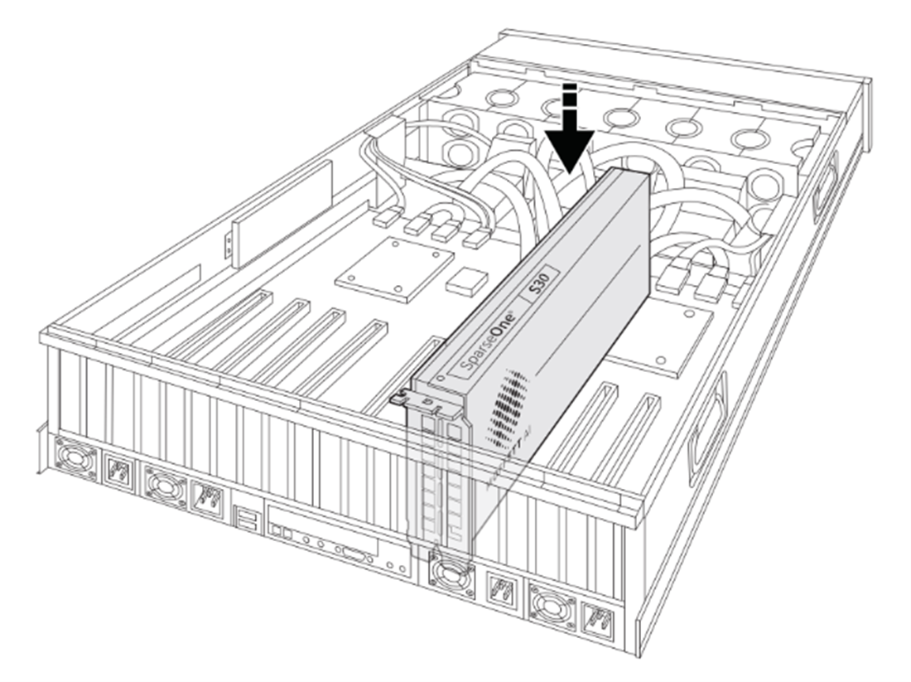
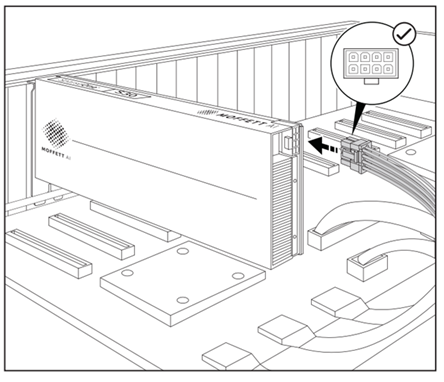
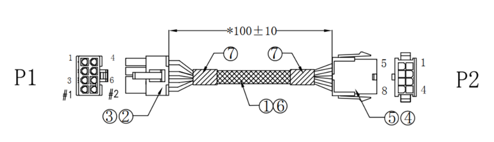
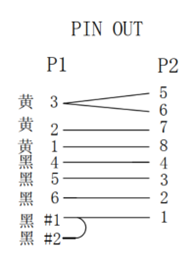

# 安装 S30 AI 计算卡

## 概述

墨芯 S30 AI 计算卡，搭配 3 颗墨芯自研的 Antoum 芯片。这款计算卡可以通过标准的 PCIe 接口，能够便捷地集成到各类主流服务器中，从而快速提升云端推理能力。墨芯 S30 不仅适用于数据中心的 CV、NLP、语音和推荐等稀疏化推理场景，更能在数据中心提供稳定的高吞吐服务。

## 安全须知

为确保人身安全和设备安全，请务必确保： 

- 保持服务器以及周围工作区域清洁无尘土。 
- 在打开服务器外壳前拔下电源线。 

除保持环境清洁及操作前断电外，还需要注意静电放电 ESD（Electro-Static Discharge）。在安装 S30 时操作不当可能因 ESD 损坏电子组件，并导致设备整体故障或间歇故障。进行拆卸和更换组件操作时，请始终遵循防 ESD 流程，包括但不限于： 

- 确保佩戴 ESD 腕带或踝带，且与皮肤接触良好。将腕带或踝带的设备端连接到底座上未涂漆的金属表面。 
- 避免让 S30 接触您的衣物。腕带或踝带只能防止身体产生的 ESD 影响电子组件，但无法防止衣物产生的 ESD。 
- 拿起 S30 时只能接触其托架或边缘，避免接触印刷电路板或连接器。 
- 将 S30 放在防静电的表面上，例如套件中提供的防静电袋。 
- 如需退还 S30，请立即将其放入防静电袋内。 

## 安装 S30 **AI** 计算卡

下文描述了在服务器上安装 S30 AI 计算卡的步骤，具体步骤如下：

1. 关闭服务器并拔下电源线。

2. 打开服务器盖板。

3. 拆掉挡风条。

4. 在服务器主板上找到 PCle 卡槽，并将 S30 插入 PCIe 插槽。

   

 

5. 为 S30 接入电源。S30 提供一个 PCIe 8-Pin 的电源接口，您可以直接使用服务器内的 PCIe 8-Pin 电源插头连接到 S30 的 PCIe 8-pin 电源接口上。
   
   
   
    如果服务器提供的供电方式为 CPU 8-pin，那么您需要通过转接线，连接到 S30 的 PCIe 8-pin 连接器上。转接线如下所示：
   
    
   
    
   
1. 为服务器装好盖板。 

2. 连接服务器电源线并启动服务器。

3. 服务器启动成功后，执行以下命令验证是否已经成功安装墨芯 S30。

   ```Bash
   $  lspci |grep 1f36 |wc -l 
   3 #S30上有3颗墨芯自研Antoum芯片（device），所以返回的device数量为3的整倍数才能说明S30安装成功。
   ```

    如果您的系统上没有`lspci`命令，请执行以下命令安装 `pciutils` 软件包：

    ```Bash
    # Ubuntu/debian 
    $ apt-get install pciutils
    # RHEL/CentOS/fedora
    $ dnf install pciutils
    ```

