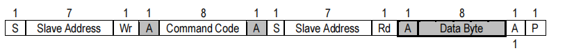

#  SMBus 使用说明

## 概述

本文介绍了墨芯 AI 计算卡上的 SMBus 规格信息，包括 SMBus 寄存器定义、地址和详细说明，以及获取墨芯 AI 计算卡相关信息的前置操作。此外，您在 BMC 适配时也可参考本文获取墨芯 AI 计算卡的相关信息。

## SMBus 规格

| **接口**             | **地址** |
| -------------------- | -------- |
| SMBus（7 bits 地址） | 0x58     |

下图描述了Read Byte Protocol：




下图描述了Wirte Byte Protocol：


SMBus寄存器位宽为8位，下表描述了寄存器基本读取流程(S: Slave, M: Master):

| **方向** | **位数** | **内容**              |
| -------- | -------- | --------------------- |
| M->S     | 1        | Start                 |
| M->S     | 8        | Slave Address + Write |
| S->M     | 1        | ACK                   |
| M->S     | 8        | Register Address      |
| S->M     | 1        | ACK                   |
| M->S     | 1        | Start                 |
| M->S     | 8        | Slave Address + Read  |
| S->M     | 1        | ACK                   |
| S->M     | 8        | Data Byte[7:0]        |
| M->S     | 1        | NACK                  |
| M->S     | 1        | Stop                  |

## SMBus 寄存器描述

SMBus 相关的设计如下：

| **寄存器定义**                | **地址**  | **读写权限** | **说明**                                                     | **示例**                                                     |
| ----------------------------- | --------- | ------------ | ------------------------------------------------------------ | ------------------------------------------------------------ |
| 芯片温度                      | 0x4E      | RO           | [7:0] 芯片温度 数据类型：int8_t  单位：摄氏度                | 芯片温度：44 摄氏度                                          |
| 板卡温度                      | 0x74      | RO           | [7:0] 芯片温度 数据类型：int8_t  单位：摄氏度                | 板卡温度：38 摄氏度                                          |
| 内存温度状态                  | 0x76      | RO           | [7:0] 内存温度状态  数据类型：uint8_t <br />0x0： -25 摄氏度以下 <br />0x1 ：-25 ～ 85 摄氏度 <br />0x2： 85 摄氏度以上 | [7:0] 内存温度状态数据类型：uint8_t <br />0x0 -25 摄氏度以下 <br />0x1 -25 ～ 85 摄氏度 <br />0x2 85 摄氏度以上 |
| Ecc State                     | 0x4F      | RO           | [0] Ecc State 标志位 0：disable 1：enable [1] Ecc 1 bit Status 标志位 0：no error 1：error [2] <br />Ecc 2 bits Status 标志位 0：no error 1：error [7:3] Reserved | Ecc State: enable. Ecc 1 bit Status: no error. Ecc 2 bits Status: no error. |
| DDR Ecc Error 1 bit Counts    | 0x58-0x59 | RO           | DDR Ecc Error 1 bit Counts <br />数据类型：uint16_t <br />0x58 表示[7:0]<br /> 0x59 表示[15:8] | DDR Ecc Error 1 bit Counts: 0                                |
| DDR Ecc Error 2 bits Counts   | 0x5A-0x5B | RO           | DDR Ecc Error 2 bits Counts <br />数据类型：uint16_t <br />0x5A 表示[7:0] <br />0x5B 表示[15:8] | DDR Ecc Error 2 bits Counts: 0                               |
| PCIe Error Counts             | 0x70-0x73 | RO           | 数据类型：uint32_t <br />0x70 表示[7:0] <br />0x71 表示[15:8] <br />0x72 表示[23:16] <br />0x73 表示[31:24] | PCIe Error Counts: 0                                         |
| Max PCIe Link Speed/Width     | 0x77      | RO           | [2:0] - Link Speed 0x0:unknown <br />0x1:2500MTPS PCIe Gen 1.0 <br />0x2:5000MTPS PCIe Gen 2.0 <br />0x3:8000MTPS PCIe Gen 3.0<br /> 0x4:16000MTPS PCIe Gen 4.0 <br />0x5:32000MTPS PCIe Gen 5.0 <br />[6:4] - Link Width 0x0:unknown 0x1:x1 0x2:x2 0x3:x4 0x4:x8 0x5:x16 0x6:x32 | Max PCIe Link Speed/Width: PCIe Gen 3.0 x16                  |
| Current PCIe Link Speed/Width | 0x78      | RO           | 同上 Max PCIe Link Speed/Width                               | Current PCIe Link Speed/Width: PCIe Gen 3.0 x16              |
| Nncore Utilization            | 0x79      | RO           | [7:0] Nncore 利用率<br /> 数据类型：uint8_t，例如 0x10 表示 16% | Nncore Utilization: 0%                                       |
| DDR Utilization               | 0x7A      | RO           | [7:0] DDR 利用率 <br />数据类型：uint8_t                     | DDR Utilization: 4%                                          |
| 芯片功耗                      | 0x75      | RO           | [7:0] 芯片功耗 <br />数据类型：uint8_t <br />单位：瓦特（W） | 芯片功耗：24 W                                               |
| 芯片电压                      | 0xCC-0xCD | RO           | 表示芯片电压 <br />数据类型：uint16_t <br />单位：毫伏（mV ）<br />0xCC 电压低 8 位 <br />0xCD 电压高 8 位 | 芯片电压：980mV                                              |
| 内存电压                      | 0xCC-0xCD | RO           | 表示内存电压 <br />数据类型：uint16_t <br />单位：毫伏（mV ）<br />0xCC 电压低 8 位 <br />0xCD 电压高 8 位 | 内存电压：980mV                                              |
| Product Name                  | 0xCE-0xD8 | RO           | 表示计算卡产品名，MOFFETT S30 字符对应的 ASCII 码如下：<br />0xCE 表示字符 M 对应的 ASCII 码 <br />0xCF 表示字符 O 对应的 ASCII 码 <br />0xD0 表示字符 F 对应的 ASCII 码 <br />0xD1 表示字符 F 对应的 ASCII 码 <br />0xD2 表示字符 E 对应的 ASCII 码 <br />0xD3 表示字符 T 对应的 ASCII 码 <br />0xD4 表示字符 T 对应的 ASCII 码 <br />0xD5 表示字符 空格 对应的 ASCII 码<br /> 0xD6 表示字符 S 对应的 ASCII 码 <br />0xD7 表示字符 3 对应的 ASCII 码 <br />0xD8 表示字符 0 对应的 ASCII 码 | Product Name: MOFFETT S30                                    |
| System Bus ID                 | 0xD9      | RO           | [7:0] 表示 System Bus ID                                     | System Bus ID: 0x04                                          |
| Subsystem Vendor ID           | 0xDA-0xDB | RO           | 表示 SVID: 0x1f36 0xDA: 0x36 0xDB: 0x1f                      | SVID: 0x1f36                                                 |
| Subsystem ID                  | 0xDC-0xDD | RO           | 表示 SSID: 0x7000 0xDC: 0x00 0xDD: 0x70                      | SSID: 0x7000                                                 |
| Vendor ID                     | 0xDE-0xDF | RO           | 表示 VID: 0x1f36 0xDE: 0x36 0xDF: 0x1f                       | VID: 0x1f36                                                  |
| Device ID                     | 0xE0-0xE1 | RO           | 表示 DID: 0x7030 0xE0: 0x30 0xE1: 0x70                       | DID: 0x7030                                                  |
| 驱动版本                      | 0xE2-0xE4 | RO           | 0xE2 表示主版本号 <br />0xE3 表示子版本号<br />0xE4 表示 patch 号，例如 v3.2.1 | 驱动版本：3.3.1                                              |
| 固件版本                      | 0xE5-0xE7 | RO           | 0xE5 表示主版本号<br /> 0xE6 表示子版本号 <br />0xE7 表示 patch 号，例如 v1.0.13 | 固件版本：1.0.13                                             |
| 硬件版本                      | 0xE8-0xE9 | RO           | 0xE8 表示主版本号 <br />0xE9 表示子版本号                    | 硬件版本：2.0                                                |
| PN                            | 0xEA-0xF2 | RO           | 表示 PN（“00S30-00A”字符对应的 ASCII 码） <br />0xEA 表示字符 0 对应的 ASCII 码 <br />0xEB 表示字符 0 对应的 ASCII 码 <br />0xEC 表示字符 S 对应的 ASCII 码 <br />0xED 表示字符 3 对应的 ASCII 码 <br />0xEE 表示字符 0 对应的 ASCII 码 <br />0xEF 表示字符 - 对应的 ASCII 码 <br />0xF0 表示字符 0 对应的 ASCII 码 <br />0xF1 表示字符 0 对应的 ASCII 码<br /> 0xF2 表示字符 A 对应的 ASCII 码 | PN: 00S30-00A                                                |
| SN                            | 0xF3-0xF9 | RO           | 表示 SN，详细说明见下方表格                                  | SN: 2023110400010                                            |
| 出厂时间                      | 0xFB-0xFE | RO           | 0xFB 表示年份高 2 位<br />0xFC 表示年份低 2 位<br />0xFD 表示月份 <br />0xFE 表示日期 | 出厂时间：20230212                                           |
| 报错信息状态位                | 0xFF      | RO           | [7:1] Reserved [0] 标志位 0：正常 1：异常                    | 报错信息状态位：0                                            |

下表以 SN 号 `2023110400010` 为例，详细讲述了 SN 号的相关信息：

<table>
	<tr>
		<th rowspan=3>SN号</th>
		<th colspan=7>描述</th>
	</tr>
	<tr>
		<td colspan=2>生产日期(年)</td>
		<td>生产日期(周)</td>
        <td>产品类型</td>
        <td colspan=3>生产序列号</td>
	</tr>
    <tr>
		<td>0xF3</td>
		<td>0xF4</td>
        <td>0xF5</td>
        <td>0xF6</td>
        <td>0xF7</td>
        <td>0xF8</td>
        <td>0xF9</td>
	</tr>
    <tr>
		<td>2023110400010</td>
		<td>0x14</td>
        <td>0x17</td>
        <td>0x0b</td>
        <td>0x04</td>
        <td>0x00</td>
        <td>0x01</td>
        <td>[7:4]Reserved [3:0]0x0</td>
	</tr>
</table>

## 前置操作

> **注意**：S30 板卡内置 3 颗墨芯 Antoum 芯片（也称设备，Device），每次读取某个设备产品信息都需要先执行相应的前置操作后，才能读取到对应数据。

### 前置操作步骤

读取设备 1 前置操作：

1. 0x3f 地址写入 0x01，配置设备 ID。
2. 0x40 地址写入 0x01，配置读取操作。
3. 0x45 地址写入 0xb8，配置读取长度。
4. 0x46 地址写入 0x02，触发读取操作。
5. polling 0x46 地址的 bit0， bit0=1 时表示 data 就绪。 
6. 0x46 地址写入 0x00。

读取设备 2 前置操作：

1. 0x3f 地址写入 0x02，配置设备 ID。
2. 0x40 地址写入 0x01，配置读取操作。
3. 0x45 地址写入 0xb8，配置读取长度。
4. 0x46 地址写入 0x02，触发读取操作。
5. polling 0x46 地址的 bit0， bit0=1 时表示 data 就绪 。
6. 0x46 地址写入 0x00。

读取设备 3 前置操作：

1. 0x3f 地址写入 0x03，配置设备 ID。
2. 0x40 地址写入 0x01，配置读取操作。
3. 0x45 地址写入 0xb8，配置读取长度。
4. 0x46 地址写入 0x02，触发读取操作。
5. polling 0x46 地址的 bit0， bit0=1 时表示 data 就绪 。
6. 0x46 地址写入 0x00。

### 前置操作**示例**

目前 MCU 没有自动获取 GPU 的数据，需要手动读取，读取方式如下：

> **说明**：MCU 设计为 GPU1，GPU2，GPU3。

1. 手动加载 SMBus 驱动。

   ```Bash
   $ modprobe i2c-i801
   ```

2. 查看主板 I2C 端口详情。

   ```Bash
   $ i2cdetect -l
   i2c-3   i2c             i915 gmbus dpb                          I2C adapter
   i2c-1   smbus           SMBus I801 adapter at f040              SMBus adapter
   i2c-6   i2c             DPDDC-D                                 I2C adapter
   i2c-4   i2c             i915 gmbus dpd                          I2C adapter
   i2c-2   i2c             i915 gmbus dpc                          I2C adapter
   i2c-0   i2c             Synopsys DesignWare I2C adapter         I2C adapter
   i2c-5   i2c             DPDDC-C                                 I2C adapter
   ```

	从回显信息可知，i2c 端口 1 用于 SMBus。

3. 执行以下命令，获取 GPU 数据。

    > **注意**：下文中的 1 为用于 SMBus 通信的端口号，请根据实际情况进行调整。

   - 获取 GPU1 数据前置操作步骤：

      ```Bash
      i2cset -y -f 1 0x58 0x3f 0x01 #指定获取 GPU1
      i2cset -y -f 1 0x58 0x40 0x01 #读操作
      i2cset -y -f 1 0x58 0x45 0xB8 #读取的长度
      i2cset -y -f 1 0x58 46 0x02 #触发读取操作
      polling 0x46地址的bit0， bit0=1时表示data就绪 
      i2cset -y -f 1 0x58 0x46 0x00 #0x46 地址写入0x00
      ```

   - 获取 GPU2 数据前置操作步骤：

       ```Bash
       i2cset -y -f 1 0x58 0x3f 0x02 #指定获取 GPU2
       i2cset -y -f 1 0x58 0x40 0x01 #读操作
       i2cset -y -f 1 0x58 0x45 0xB8 #读取的长度
       i2cset -y -f 1 0x58 0x46 0x02 #触发读取操作
       polling 0x46地址的bit0， bit0=1时表示data就绪 
       i2cset -y -f 1 0x58 0x46 0x00 #0x46 地址写入0x00
       ```

   - 获取 GPU3 数据前置操作步骤：

      ```Bash
      i2cset -y -f 1 0x58 0x3f 0x03 #指定获取 GPU3
      i2cset -y -f 1 0x58 0x40 0x01 #读操作
      i2cset -y -f 1 0x58 0x45 0xB8 #读取的长度
      i2cset -y -f 1 0x58 0x46 0x02 #触发读取操作
      polling 0x46地址的bit0， bit0=1时表示data就绪 
      i2cset -y -f 1 0x58 0x46 0x00 #0x46 地址写入0x00
      ```

前置操作完成后即可读取对应寄存器，获取对应信息。

## 使用示例

下文介绍了通过 SMBus 获取墨芯 AI 计算卡上信息数据的步骤。具体步骤如下：

1. 手动加载 SMBus 驱动。

    ```Bash
    $ modprobe i2c-i801
    ```

2. 查询主板 I2C 端口详情。

   ```Bash
   $ i2cdetect -l
   i2c-3   i2c             i915 gmbus dpb                          I2C adapter
   i2c-1   smbus           SMBus I801 adapter at f040              SMBus adapter
   i2c-6   i2c             DPDDC-D                                 I2C adapter
   i2c-4   i2c             i915 gmbus dpd                          I2C adapter
   i2c-2   i2c             i915 gmbus dpc                          I2C adapter
   i2c-0   i2c             Synopsys DesignWare I2C adapter         I2C adapter
   i2c-5   i2c             DPDDC-C                                 I2C adapter
   ```

3. 查看 I2C 端口下挂载的设备：

   ```Bash
      $ i2cdetect -y 1 
   ```

   > **注意**：参数 `1` 表示 `i2c-1`，请根据上一步骤中 SMBus 对应的 i2c 地址进行调整。

    预期结果：

    ```Bash
    # 结果表示在 I2C 端口 1 下有识别到地址为 0x58 的设备，对应 MCU的地址
         0  1  2  3  4  5  6  7  8  9  a  b  c  d  e  f
    00:          -- -- -- -- -- 08 -- -- -- -- -- -- --
    10: -- -- -- -- -- -- -- -- -- -- -- -- -- -- -- --
    20: -- -- -- -- -- -- -- -- -- -- -- -- -- -- -- --
    30: 30 31 -- -- 34 35 36 -- -- -- -- -- -- -- -- --
    40: -- -- -- -- 44 -- -- -- -- -- -- -- -- -- -- --
    50: 50 -- 52 -- -- -- -- -- 58 -- -- -- -- -- -- --
    60: -- -- -- -- -- -- -- -- -- -- -- -- 6c -- -- --
    70: -- -- -- -- -- -- -- --
    ```

4. 读取设备信息。

   ```Bash
      #i2cget –y –f 端口号 设备地址 寄存器地址
      i2cget -y -f 1 0x58 0x01
   ```

    预期结果：

    ```Bash
    0x00
    ```