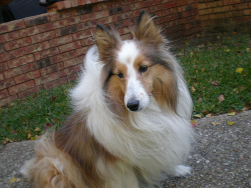

# ResNet50 部署手册

## 概述

本章节我们会演示如何使用 SOLA Runtime API 来开发一个简单的图片分类应用。

## 模型介绍

关于 resnet50 模型介绍可以参考 [Deep Residual Learning for Image Recognition](https://arxiv.org/abs/1512.03385) 。

有关输入输出的基本信息如下：

- Input: RGB 图片, 分辨率处理为 224 高 x 224 宽
- Output: 图片分类标签
- Batch size: 4

参照 MLPerf Offline 模式的运行条件，我们会一次性加载所有图片，再进行分批推理。

MLPref Offline ResNet-50 输入输出数据如下：

- 总图片数量: 50000
- 输入 query: [ 50000, 224, 224, 3 ] dtype=uint8, 以二进制格式保存
- 输出 query: [ 50000, 1024 ] dtype=int64, 以二进制格式保存

## 环境依赖

以下为运行 ResNet50 所需要的环境依赖：

- 编译器: g++ >= 7.5
- Python 环境: numpy, opencv=4.8.1, tensorflow

## 流程介绍

部署模型分为四个步骤：下载、编译、运行、验证，每个步骤都提供了对应的默认脚本。

下载：`prepare.sh`

编译：`build.sh`

运行：`run.sh`

验证：`verify.sh`

你也可以参考以下步骤手动部署模型。

### 部署步骤

1. 下载模型和数据集

   可以执行以下脚本下载模型依赖，下载后会自动进行预处理：

   ```bash
   ./prepare.sh
   ```

   若脚本执行失败，也可以通过以下链接手动下载并解压：

   ```bash
   https://moffett-oss-bucket01.oss-cn-shenzhen.aliyuncs.com/sola-demo/resnet50/resnet50_demo.tar.gz   
   ```

   并手动执行预处理命令（需要 python 环境，激活方式见主目录 README.md）

   ```bash 
   python -s scripts/gen.py --image_dir data/resnet50_demo/ILSVRC2012_img_val --val_map_path data/resnet50_demo/ILSVRC2012_validation_ground_truth_caffe.txt --cache_dir data/resnet50_demo/ --duplicate 1
   ```

   

2. 编译部署代码

   ```bash 
   ./build.sh
   ```

3. 运行

   ```bash 
   # 默认只执行device 0
   ./run.sh
   ```

   在脚本中可以自行修改参数， `-d` 可以指定运行设备，`-f` 指定运行模式（broadcast/split）， `-c` 指定运行次数。

4. 验证结果

   ```BASH
   ./verify.sh
   ```

这是一个输出示例

```
Image [  3] Prediction [230] Label [230]
```
> 比如根据 Imagenet2012 **230** 的标签为 **hetland_sheepdog**

## Predict result

推理结果如下：

SOLA resnet50 **Imagenet2012 Validation Set** 精度为 **76.4280% 。**

## 性能

以下为基于 MOFFETT S4 的运行结果：

| Model | Batch Size | INT8 QPS |
| ----- | ---------- | -------- |
| RN50  | 4          | 25014    |
