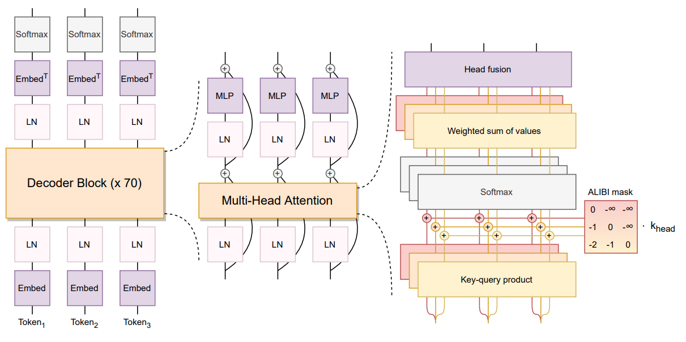

BLOOM-176B 部署手册
===============
## **BLOOM 模型简介**

BLOOM（BigScience Large Open-science Open-access Multilingual Language Model） 模型是一个功能强大的开源大语言模型，支持多达 59 种语言，参数规模高达 176B。它基于 Megatron-LM GPT2 进行训练，采用解码器唯一结构，并运用了多种技术来提升性能。该模型在 ROOTS 语料库上进行训练，展现了有竞争力的性能，并在多任务提示微调后表现更佳。BLOOM 模型由众多 AI 研究人员合作完成，旨在推动自然语言处理技术的民主化。

本文介绍如何在 MOFFETT AI 加速卡上利用 SOLA 部署 BLOOM 176B 模型。

## **模型架构**



### **模型配置**

- num_layers: 24
- num_heads: 112
- hidden_size: 14336
- vocab_size: 46152
- batch_size: 1
- token_num: 1
- max_seq_len: 256
- data_type: MixInt8Bf16

### **系统要求**

- 至少 24 颗 MOFFETT Antoum 芯片
- 支持 avx512f 的 CPU

## 测试环境

- 2x Intel(R) Xeon(R) Platinum 8380 CPU @ 2.30GHz
- 16x 64GiB DDR4 3200 MHz

## 前提条件

请参见《SOLA Runtime 示例程序》完成基础环境配置。

## 使用**流程**

部署模型分为以下四个步骤：

> **说明**： 我们为以下每个步骤都提供了对应的脚本，您可以直接使用。

1. 下载模型和数据集：`prepare.sh`。
2. 编译模型：`build.sh`。
3. 运行模型：`run.sh`。
4. 验证运行结果：`verify.sh`。

你也可以参考以下步骤手动部署模型。

### **部署步骤**

1. 执行 **prepare.sh** 脚本，下载模型和数据集，下载完成后后会自动进行预处理。

   ```Bash
   $ cd bloom-176b
   $ ./prepare.sh
   ```

    若脚本执行失败，您也可以通过以下链接手动下载并解压：

    ```Bash
    $ wget https://moffett-oss-bucket01.oss-cn-shenzhen.aliyuncs.com/sola-demo/bloom176b/bloom176b_demo.tar.gz
    $ tar -zxvf bloom176b_demo.tar.gz
    ```

2. 编译模型。

    ```Bash
    $ ./build.sh
    ```

3. 运行模型，可以执行以下脚本验证精度和性能。

   ```Bash
   $ ./run.sh
   ```

    也可以手动运行，程序接受两个参数，第一个参数为模型路径，第二个参数为模式，模式是可选的：

    ```Bash
    # 问答模式
    ./build/bloom data/model/bloom176b_demo/
    # 无限问答模式
    ./build/bloom data/model/bloom176b_demo/ inf_mode
    # 自动问答模式
    ./build/bloom data/model/bloom176b_demo/ data/questions.txt
    # 验证模式
    ./build/bloom data/model/bloom176b_demo/ verify
    ```

4. 验证模式下验证结果

    ```Bash
    $ ./verify.sh
    ```

### **性能指标参考**

| **throughput** | **latency** |
| -------------- | ----------- |
| 38 tokens/s    | 26 ms/token |

## 更多信息

关于 BLOOM 176B 模型的更多信息，请参见[ BLOOM 176B 模型论文](https://arxiv.org/pdf/2211.05100.pdf)。

