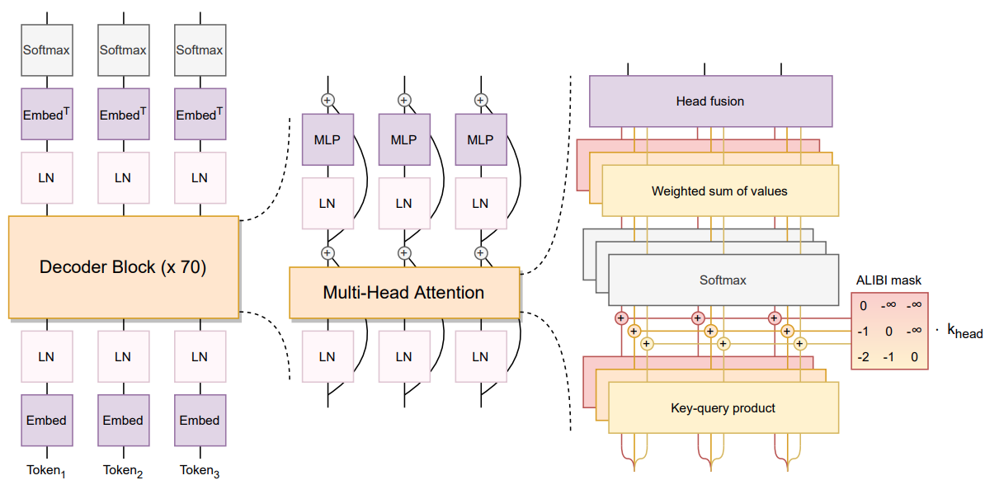

# BLOOM 7B 模型部署手册

## **BLOOM 模型简介**

BLOOM （BigScience Large Open-science Open-access Multilingual Language Model）模型是一个强大的语言模型， 是在 46 种自然语言和 13 种编程语言上训练的 1760 亿参数语言模型，本文介绍如何在 MOFFETT AI 加速卡上利用 SOLA 部署 BLOOM 7B 模型。

## **模型**架构



## **模型配置**

- num_layers: 24
- num_heads: 32
- hidden_size: 4096
- vocab_size: 250680
- batch_size: 1
- token_num: 1
- max_seq_len: 256
- data_type: Bf16

## 模型输入

- word embedding
- alibi position embedding
- gather_H_index
- scatter_Gcb_index
- scatter_W_index

## 系统要求

- 至少 12 颗 MOFFETT Antoum 芯片
- 支持 avx512f 的 CPU

## 测试环境

- 2x Intel(R) Xeon(R) Platinum 8380 CPU @ 2.30GHz
- 16x 64GiB DDR4 3200 MHz

## 前提条件

请参见《SOLA Runtime 示例程序》完成基础环境配置。

## 使用**流程**

部署模型分为以下四个步骤：

> **说明**： 我们为以下每个步骤都提供了对应的脚本，您可以直接使用。

1. 下载模型和数据集：`prepare.sh`。
2. 编译模型：`build.sh`。
3. 运行模型：`run.sh`。
4. 验证运行结果：`verify.sh`。

你也可以参考以下步骤手动部署模型。

## 使用示例

1. 执行 **prepare.sh** 脚本，下载模型和数据集，下载完成后后会自动进行预处理。

    ```Bash
    $ cd bloom-7b
    $ ./prepare.sh
    ```

    若脚本执行失败，您可以通过以下链接手动下载并解压：

    ```Bash
    $ wget https://moffett-oss-bucket01.oss-cn-shenzhen.aliyuncs.com/sola-demo/bloom7b/bloom7b_demo.tar.gz 
    $ tar -zxvf bloom7b_demo.tar.gz
    ```

2. 编译部署代码。

   ```Bash
   $ ./build.sh
   ```

3. 运行模型，验证模型的精度和性能。

   ```Bash
   $ ./run.sh
   ```

   该程序支持手动运行，并接受两个参数。第一个参数是模型路径，用于指定模型所在的位置。第二个参数为模式，用于设置程序运行模式，该参数是可选的。

   ```Bash
      # 问答模式
      $ ./build/bloom data/model/bloom7b_demo/
      # 无限问答模式
      $ ./build/bloom data/model/bloom7b_demo/ inf_mode
      # 自动问答模式
      $ ./build/bloom data/model/bloom7b_demo/ data/questions.txt
      # 验证模式
      $ ./build/bloom data/model/bloom7b_demo/ verify
   ```

3. 验证模式下验证结果。

   ```Bash
   $ ./verify.sh
   Verification passed
   Device total time: 15166580ns
   Device execution times are as expected
   Performance test passed
   ```

## 性能指标参考

| **throughput** | **latency**     |
| -------------- | --------------- |
| 52.300 token/s | 19.120 ms/token |

## 更多信息

更多信息，请参见[ BLOOM 7B 模型论文](https://arxiv.org/pdf/2211.05100.pdf)。
